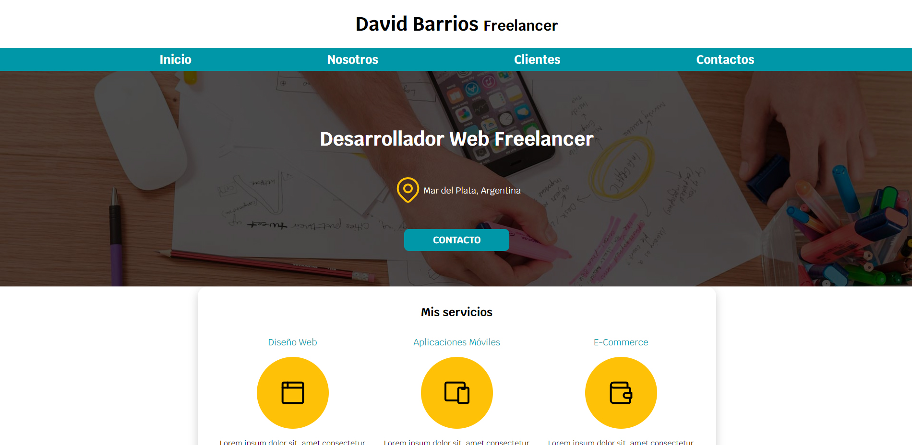
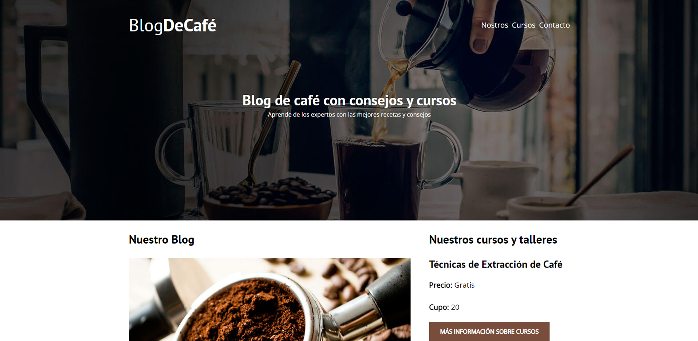
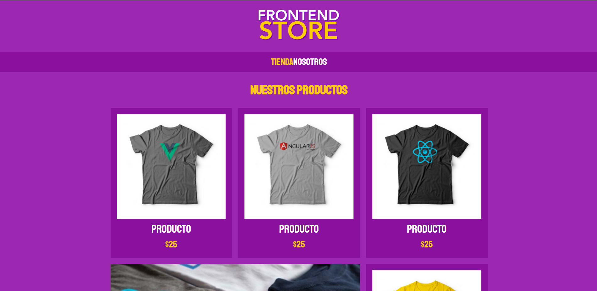
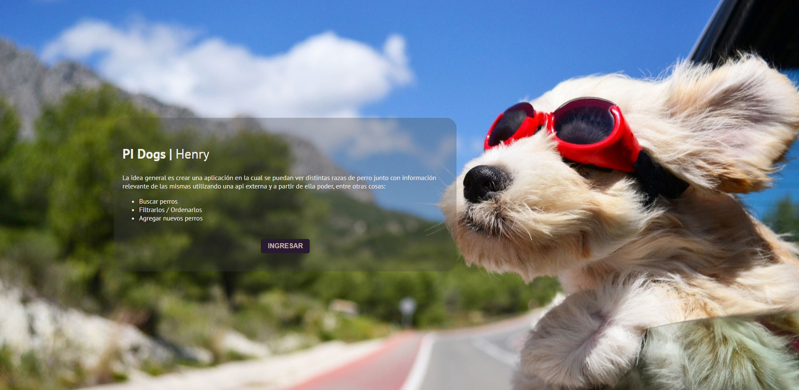
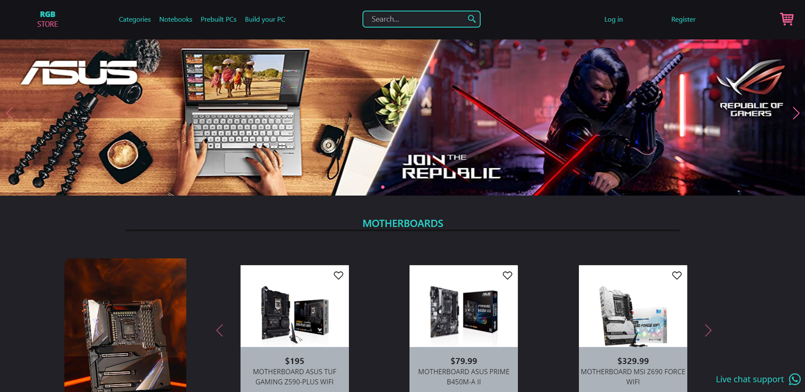

<h1 align='center'>Bienvenidos a mi perfil de GitHub, soy David Barrios!</h1>

<h2 align="center">Full Stack Developer 💻</h2>
<h2 align="center">De Argentina para todo el 🌍</h2>
 
<h3 align="center">Mi nombre es David Barrios, me forme como Full Stack web developer en Henry.</h3> 
<h3 align="center">
Para mi la comunicación y el trabajo en equipo es esencial para poder crecer como desarrollador. Soy proactivo y metódico, siempre busco nuevos retos y me adapto fácilmente a los cambios, estoy abierto a aprender nuevas tecnologías y lenguajes.
</h3>
 
 
<h4>Estoy un poco inactivo por acá, pero vas a poder ver toda mi actividad por aquí <a href="https://gitlab.com/dabarrio">GitLab</a></h4>
<h1 align="center">Mis skills</h1>

    
 

    

 
 

 <h1 align="center">Mis proyectos</h1>
 

 
 
 

 

 
 <h1 align="center">Contacto</h1>

